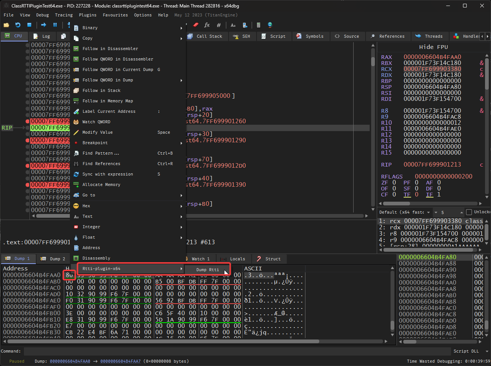

# x64dbg RTTI Plugin

A plugin to quickly retrieve RTTI information (if present) at a memory address.

There's a wealth of information present in RTTI that's of use when reverse engineering.  This plugin aims to make this information easily available to the user.

## Demo

https://github.com/colinsenner/rtti-plugin-x64dbg/assets/13701799/1443cd56-6bc7-4a95-aa60-6eda23b95cac

In the demo I have an executable (also included in the repo) named `ClassRTTIPluginTest64` and 3 created classes with RTTI information: `ClassA/B/C`. I've set a breakpoint at each class constructor and then used the plugin to retrieve the RTTI information from the memory dump.

## Usage

1. Select an address in the memory dump you suspect is an object with RTTI information. 
2. Right-click the address and select `Rtti-plugin-x64 -> Dump Rtti`.  If the address contains RTTI information, a dialog will appear at the bottom of the screen and also in the `Log` window.

## Installation
1. Compile the solution in Release mode for x86 and x64.
2. Copy `Rtti.dp32` from the /bin to your `x64dbg\release\x32\plugins` directory.
3. Copy `Rtti.dp64` from the /bin to your `x64dbg\release\x64\plugins` directory.

## Tests
There is an included project called `ClassRTTIPluginTest`.  You can compile these and use them to test the functionality.  On compilation these are copied to the `/bin` directory.

The tests have breakpoints after the creation of the class, so open the tests in x64dbg, and run until you hit the breakpoint.

## Reporting Crashes

If you find a crash please submit an issue on github or open a pull request.

## References
There are references for finding Rtti information included in the `/docs` directory.  Thanks to the authors of the following papers:

* [Reversing C++ by Paul Vincent Sabanal and Mark Vincent Yason](https://www.blackhat.com/presentations/bh-dc-07/Sabanal_Yason/Paper/bh-dc-07-Sabanal_Yason-WP.pdf)
* [Visual C++ RTTI Inspection](https://blog.quarkslab.com/visual-c-rtti-inspection.html)
* [Reversing Microsoft Visual C++ Part II: Classes, Methods and RTTI - by Igorsk](http://www.openrce.org/articles/full_view/23)
* [Recovery of Object Oriented Features from C++ Binaries](https://www.ece.umd.edu/~barua/yoo-APSEC-2014.pdf)
